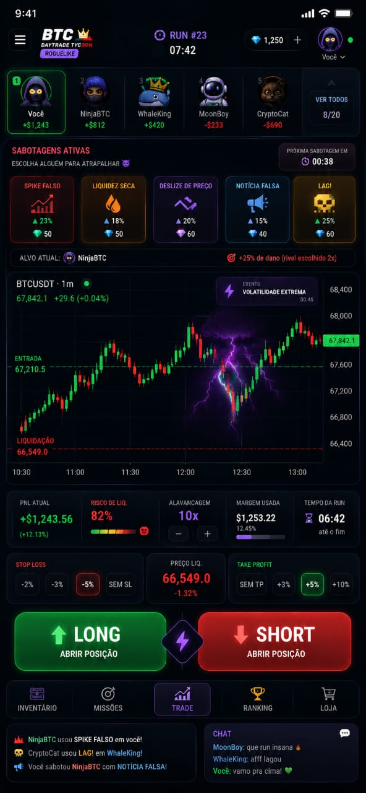

# PRD — BTC Daytrade Tycoon: Roguelike PvP ("Run Mode")

> **Status:** Norte de produto (north star). Este documento consolida a visão
> roguelike + runs + sabotagens + economia de called shots e passa a orientar a
> priorização do [ROADMAP](./ROADMAP.md).
>
> **Referência visual:** [`docs/vision-roguelike-mobile.jpeg`](./docs/vision-roguelike-mobile.jpeg)

---

## 1. Visão Geral

Transformar o simulador solo em um **jogo PvP de sessões curtas**: runs
roguelike de ~6–10 minutos onde 8–20 jogadores operam o **mesmo dia histórico
de Bitcoin** (mesma seed, data oculta), ganham **diamantes** acertando análises
técnicas declaradas antecipadamente (**called shots**) e gastam diamantes
**sabotando a percepção e a execução dos rivais** — nunca o mercado.

Liquidação é permadeath da run. Habilidade gera moeda; moeda gera interação
social; sessão curta gera "mais uma run".

---

## 2. Pilares de Design

1. **Mercado compartilhado e justo** — todos veem exatamente as mesmas candles
   históricas. Nenhuma mecânica altera o preço real.
2. **Habilidade é a única fonte de poder** — diamante nasce de leitura técnica
   correta e verificável. Diamante **nunca** é vendido por dinheiro real.
3. **Sabotagem é guerra de informação** — afeta o que o alvo *vê* (percepção)
   ou *como executa* (slippage, lag), nunca o que o mercado *é*.
4. **Sessões curtas com consequência** — run cronometrada; liquidação encerra a
   run do jogador na hora.
5. **Aprender jogando** — cada mecânica reforça leitura real de price action
   (o DNA educacional do TimeWarp permanece).

---

## 3. A Run (loop roguelike)

### 3.1 Setup

- **Jogadores:** 8–20 por run (solo na Fase 1 — ver §9.3).
- **Seed compartilhada:** dia histórico + offset sorteados, idênticos para
  todos (mesma base do Daily Challenge atual). **Blind Date mantida** — a data
  real só é revelada no fim.
- **Estado inicial:** wallet fictícia padrão (ex.: $10.000), posição zerada.
- **Duração:** 6–10 min de relógio real a 60x (~6–10h históricas).

### 3.2 Fim de run

- Timer zera **ou** o jogador é liquidado (permadeath da run).
- Ranking final por **retorno % da run**.
- Recompensas de fim de run: diamantes por posição no ranking + missões
  completadas. Data histórica revelada para todos.

### 3.3 Eventos de run

Eventos globais e idênticos para todos (fairness), anunciados com countdown:

| Evento | Efeito | Duração |
|---|---|---|
| **Volatilidade Extrema** | Janela histórica de alta volatilidade destacada; multiplicadores de recompensa de calls | ~45s |
| *(futuros)* Flash Crash, Notícia Real (halving, ETF) | A definir por playtest | — |

> Eventos **não** sintetizam preço — selecionam/destacam trechos reais e
> modulam recompensas.

---

## 4. Economia de Called Shots (diamantes 💎)

### 4.1 Mecânica central

Diamante só nasce de **previsão declarada antes e cumprida**:

1. Ao abrir posição, o jogador declara o alvo via pills de TP (+3% / +5% /
   +10%) — isso **é** o called shot: direção + distância, registrado no
   servidor com o candle corrente.
2. Preço toca o alvo declarado antes de SL/liquidação → **paga diamantes**.
3. Fechamento manual no lucro antes do alvo → paga o lucro, mas **0 diamantes**
   (leu certo, mas não sustentou a tese).

### 4.2 Payout (âncoras iniciais — balancear em playtest)

`computeDiamondReward(call) = base × dificuldade × streak`

- **Dificuldade** = distância do alvo (%) × alavancagem.
- **Streak**: ×1.25 por acerto consecutivo, cap ×2. Errar zera o streak
  (não custa diamantes — o prejuízo do trade já é o custo).

| Call | Payout base |
|---|---|
| +3% @ 2x | 5 💎 |
| +5% @ 5x | 12 💎 |
| +10% @ 10x | 25 💎 |

Âncora de economia: sabotagens custam 40–60 💎 → **2 a 3 calls bons financiam
uma sabotagem**.

### 4.3 Guardas anti-farm

- Lucro mínimo (ex.: ≥0,5% da wallet) para o call contar.
- **Cap de diamantes por run** (ex.: 150 💎).
- Retornos decrescentes para calls repetidos na mesma dificuldade dentro da run.
- Cooldown entre calls premiados (ex.: 30s).

### 4.4 Verificabilidade

Candles são determinísticas (dia histórico + seed) → o servidor valida
qualquer call por replay, sem confiar no cliente. O payout é função pura,
testável como o resto do engine (`computeDiamondReward`).

### 4.5 Persistência

Diamantes **persistem entre runs** (meta-progressão; saldo no topo da tela,
como no mock). O cap por run limita inflação.

---

## 5. Sabotagens

Compradas com diamantes durante a run, aplicadas a um alvo escolhido.

| Sabotagem | Custo | Tipo | Efeito na vítima | Duração |
|---|---|---|---|---|
| **Notícia Falsa** | 40 💎 | Percepção | Banner de notícia falsa (ex.: "ETF rejeitado") | one-shot |
| **Spike Falso** | 50 💎 | Percepção | Wick falso renderizado no chart (fills não são afetados) | ~10s |
| **Liquidez Seca** | 50 💎 | Execução | Fills parciais / execução degradada | ~30s |
| **Deslize de Preço** | 60 💎 | Execução | Slippage adicional (ex.: ±0,15%) nos fills | ~30s |
| **LAG!** | 60 💎 | Percepção | Atraso artificial de 1–2s no feed visual | ~20s |

Regras:

- **Foco em rival:** repetir o mesmo alvo dá bônus de efeito (+25% no 2º uso —
  "rival escolhido 2x" do mock).
- **Transparência post-run:** toda sabotagem aparece no feed de eventos e no
  resumo final ("NinjaBTC usou SPIKE FALSO em você!").
- **Cap de sabotagens simultâneas recebidas** (ex.: 2) para não inviabilizar a
  vítima.
- **Nunca alterar as candles reais.** Efeitos de percepção são camadas visuais
  no cliente da vítima; efeitos de execução são modificadores server-side nas
  ordens dela.
- *(Futuro)* Itens defensivos (ex.: **Escudo**) no inventário.

> Os percentuais dos cards no mock (23%, 18%…) ficam definidos como
> **intensidade do efeito**; na v1 os efeitos são fixos por simplicidade
> (ver §11).

---

## 6. Meta-progressão

- **Missões** diárias/semanais: "acerte 3 rompimentos", "termine uma run sem
  usar SL", "sobreviva a um Volatilidade Extrema posicionado".
- **Badges por padrão técnico** acertado em called shots (topo duplo, bandeira,
  suporte defendido) — progressão visível de aprendizado de AT.
- **Inventário**: sabotagens comparadas antecipadamente, itens defensivos,
  cosméticos.
- **Loja**: **apenas cosméticos** (avatares, temas de chart, emotes de chat,
  molduras de ranking). Vender diamantes quebraria o pilar 2.

---

## 7. Social

- **Chat da run** (mock: canto inferior) + emotes.
- **Feed de eventos** de sabotagem em tempo real.
- **Ranking global** por semana/mês/all-time (já existe no backend) + ranking
  da run ao vivo.
- **Compartilhar resultado** da run (card com chart final + posição).

---

## 8. Fairness & Anti-cheat

- **Servidor autoritativo**: fills, PnL, validação de calls e saldo de
  diamantes calculados no servidor. (Mudança em relação a hoje, onde as stats
  de sessão são reportadas pelo cliente — limitação já documentada no README.)
- **Determinismo**: seed + dia histórico definem o candle path; o cliente só
  renderiza. Candles não trafegam pela rede em PvP — só ações de jogadores.
- **Validação de entrada** com zod + rate limiting nas rotas (base já existe).

---

## 9. Arquitetura Técnica

### 9.1 Reaproveitado do que já existe

| Peça | Uso no Run Mode |
|---|---|
| Engine de simulação (tick processor, liquidação/ordens wick-aware) | Núcleo intacto |
| Seed do Daily Challenge | Base da seed compartilhada da run |
| Backend real (auth scrypt + cookie httpOnly, `TradingSessionRecord`, leaderboard — Prisma 7 + SQLite) | Contas, histórico, rankings |
| `MobileTradingView` | Ponto de partida do shell mobile novo |

### 9.2 O que precisa nascer

- **Modelos novos**: `Run`, `RunPlayer`, `Call`, `SabotageUse`; saldo de
  diamantes no `User`.
- **Verificação server-side de fills/calls** por replay determinístico.
- **Shell mobile novo**: bottom nav (Inventário / Missões / Trade / Ranking /
  Loja), controles simplificados (LONG/SHORT grandes + pills de SL/TP),
  medidor de risco de liquidação.
- **Tempo real (Fase 3)**: WebSocket (ex.: socket.io/PartyKit) para ações de
  jogadores, sabotagens e chat. Candles nunca trafegam.
- **Migração de banco** para Postgres quando houver deploy hospedado (troca de
  provider no Prisma, já prevista).

### 9.3 Faseamento

**Fase 1 — Roguelike solo** *(sem rede nova)*
Runs cronometradas + permadeath, called shots + diamantes persistentes,
eventos de run, missões básicas, shell mobile novo.
*Aceite: jogador completa uma run de 8 min, ganha 💎 por calls declarados e
verificados, vê resumo final com streak e missões.*

**Fase 2 — PvP assíncrono**
Mesma seed diária para todos, ranking da run ao vivo (polling no backend
atual), "ghosts" de rivais (runs de outros jogadores na mesma seed replayadas
no painel de rivais). Sem sabotagem em tempo real.
*Aceite: dois jogadores na mesma seed se veem no ranking da run e comparam
resultado final.*

**Fase 3 — PvP tempo real**
Matchmaking 8–20, WebSocket, sabotagens ao vivo com feed e chat, servidor
autoritativo completo.
*Aceite: sabotagem aplicada aparece no cliente da vítima em <1s; fills e
diamantes idênticos entre servidor e replay.*

---

## 10. Métricas de Sucesso

- Retenção D1/D7 e **runs por sessão** (norte: "mais uma run").
- **Calls por run** e **taxa de acerto de calls** (saúde de dificuldade:
  ~30–45% de acerto; acima disso, payout está fácil demais).
- Sabotagens usadas por run (engajamento social) e distribuição de alvos.
- Conversão em cosméticos (monetização sem pay-to-win).

---

## 11. Decisões em Aberto

- **Idioma**: mock em PT-BR, app localizado em EN — definir mercado-alvo ou
  i18n desde a Fase 1.
- **Intensidade variável de sabotagens** (percentuais dos cards): fixo na v1;
  reavaliar como upgrade de item na meta-progressão.
- **Monetização**: só cosméticos vs. passe de temporada.
- **Compliance de lojas** (Apple/Google): mecânica de risco sem dinheiro real —
  revisar guidelines antes do lançamento mobile.
- **Balanceamento numérico** (payouts, custos, caps): âncoras deste PRD são
  ponto de partida para playtest, não contrato.

---

## 12. Não-objetivos

- Dinheiro real, prêmios em dinheiro ou qualquer ponte cripto real.
- Alterar/sintetizar dados históricos das candles (nem para eventos, nem para
  sabotagens).
- Order book / microestrutura real de mercado.
- Venda de diamantes ou de qualquer item que afete gameplay.
